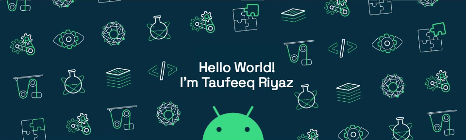

  

## ⚡ Languages, Tools and Technologies

<table> 
<tr>
<td>
<strong>Frontend & Design</strong>
</td>
<td>
<strong>DevOps & Deployment</strong>
</td>
<td>
<strong>Version Control</strong>
</td>
<td>
<strong>Editors</strong>
</td>
</tr>
<tr>
<td>

</td>
<td>

</td>
<td>

</td>
<td>

</td>
</tr>
</table>

<table>
<tr>
<td>
<strong>Backend & Databases</strong>
</td>
<td>
<strong>API & Testing</strong>
</td>
<td>
<strong>Languages</strong>
</td>
<td>
<strong>Miscellaneous</strong>
</td>
</tr>
<tr>
<td>

</td>
<td>

</td>
<td>

</td>
<td>

</td>
</tr>
</table>

## 📊 Metrics

<table>
<tr>
<td colspan = "2">

</td>
</tr>
<tr>
<td>

</td>
<td>

</td>
</tr>
<tr>
<td colspan = "2">
</td>
</tr>
</table>

## Spotify Stats

<table align="center">
  <thead>
    <tr>
      <th>🎵 Now Playing</th>
    </tr>
  </thead>
  <tbody>
      <tr>
      <td align="center">
        
      </td>
    </tr>
  </tbody>
  <thead>
    <tr>
      <th>📈 Top Tracks</th>
    </tr>
  </thead>
  <tbody>
    <tr>
      <td align="center">
        
      </td>
    </tr>
    <tr>
      <td align="center"></td>
    </tr>
    <tr>
      <td align="center">
        
      </td>
    </tr>
    <tr>
      <td align="center"></td> 
    </tr>
    <tr>
      <td align="center">
        
      </td>
    </tr>
  </tbody>
</table>
